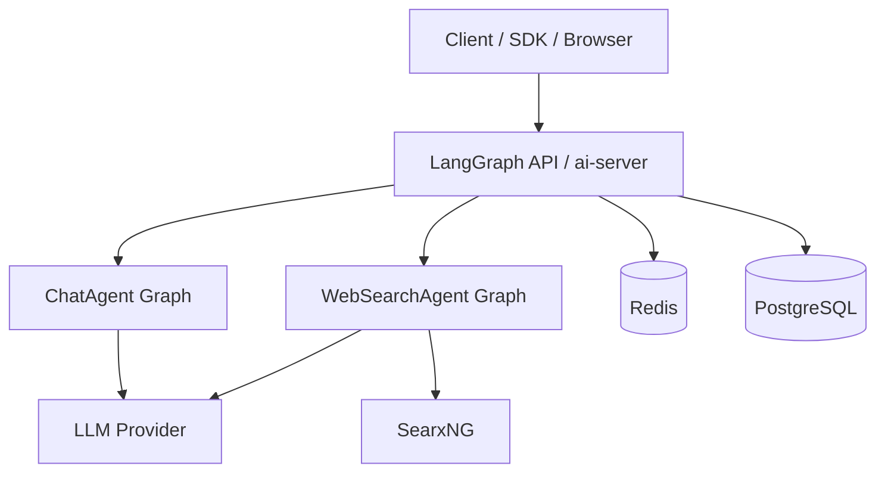
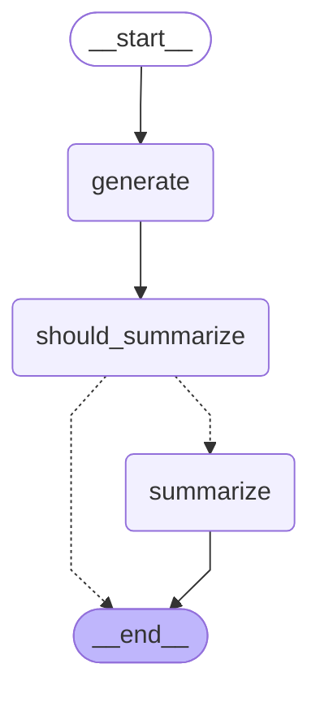
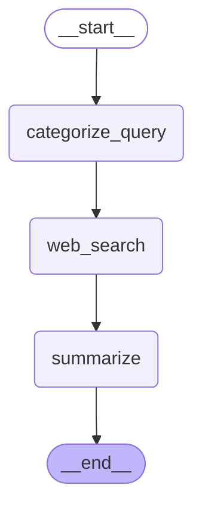

# Architecture

Generated: 2025-10-30 20:21:44

This document describes the system architecture and the agent graphs used in the project.

## Overview

- API surface: LangGraph API server (see `Dockerfile` and `langgraph.json`)
- Agents: ChatAgent and WebSearchAgent
- State & cache: Redis, Postgres (via `docker-compose.yml`)
- External services: LLM provider (OpenAI/Ollama), SearxNG (for web search)

### High-level system



## Agents

### ChatAgent graph



### WebSearchAgent graph



## Regenerating this file

Run:

```bash
python scripts/generate_architecture_md.py
```

This will patch model initialization to avoid external calls and embed up-to-date Mermaid graphs.