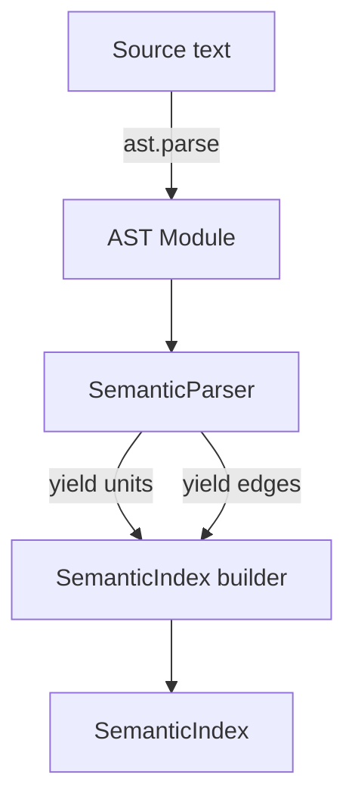

# Refactor Plan: `python_symbol_tree` → Semantic Units

Date: 2025-10-29
Owner: langgraph-agents maintainers
Status: Phase 1 (modularization) shipped
Scope: `src/utils/python_symbol_tree.py`

## TL;DR

We will evolve the current AST-based symbol extractor into a semantic, queryable index of Python code. The new model introduces first-class "semantic units" (modules/classes/functions/methods/properties/fields/type aliases/enums/protocols/imports/constants) and relationships (contains/extends/overrides/decorates/exports/imports). We’ll ship a new API that builds a `SemanticIndex`, plus an adapter that retains the legacy `ExtractResult` for backward compatibility.

Goals:
- Preserve stable IDs for unchanged headers
- Add relationships and roles (dataclass/pydantic/enum/protocol/property groups)
- Provide a query API (list public API, data models, overrides, exports)
- Keep dependencies stdlib-only

Non-goals:
- Full cross-module type resolution
- Runtime/dynamic analysis

---

## Background and current state

Current module: `src/utils/python_symbol_tree.py`
- Extracts `ModuleSymbol`, `ClassSymbol`, `FunctionSymbol`, `AttributeSymbol`
- Captures FQN, bases, decorators, parameters, annotations, docstrings, visibility
- Property methods are mapped to attribute symbols; class attributes captured
- Deterministic ID via hash of canonical header (signature/class header)
- Returns `ExtractResult` with separate lists and a `ModuleSymbol`

Limitations driving the refactor:
- No explicit relationships (overrides, contains, imports, re-exports)
- No higher-level constructs (type aliases, enums, protocols, overload groups)
- No semantic query layer; consumers must scan flat lists
- No docstring section parsing for Args/Returns/Raises

---

## Goals and non-goals

Goals
- Introduce semantic units and edges to represent structure and intent
- Stable IDs for unchanged "headers" (compatibly hashed)
- Adapter to legacy `ExtractResult`
- Simple, documented query API
- Optional enrichers (docstrings, roles) without external deps

Non-goals
- Complete name resolution across files/packages
- Dynamic execution or metaprogramming handling beyond syntax-aware fallbacks

---

## Proposed model: Semantic Units and Edges

Each unit has: `kind`, `name`, `qualname`, `module`, `filepath`, `line_range`,
`docstring`, `visibility`, `exported`, `source_snippet`, `id_sha`.

Unit kinds
- ModuleUnit
  - exports (`__all__`), imports, re-exports
  - contains edges to children
- ClassUnit
  - bases, metaclass, decorators, type params
  - flags: `abstract`, `slots_enabled`, `is_dataclass`, `is_enum`, `is_protocol`, `is_pydantic`
  - contains: FieldUnit, MethodUnit, NestedClassUnit
- MethodUnit / FunctionUnit
  - parameters (kind, annotation, default), return annotation, decorators
  - roles: `constructor` (for `__init__`), property accessors (`fget/fset/fdel`), dunder special, `async`
  - overloadGroup (via `typing.overload`)
- PropertyUnit
  - type, docstring, links to accessors
- FieldUnit (replaces AttributeSymbol)
  - annotation, default, `is_classvar`, `is_property` (for synthesized attrs)
- TypeAliasUnit
  - alias name, target expression
- EnumUnit
  - members, optional flags
- ProtocolUnit
- ImportUnit
  - `import` and `from ... import ...`, alias, relative level, type-checking guarded
- ConstantUnit/VariableUnit
  - UPPER_CASE conventions; snippet of value
- DocSectionUnit (optional)
  - parsed docstring sections (Args, Returns, Raises, Examples)

Edges
- `contains` (module→unit, class→member)
- `extends` (class→base)
- `overrides` (method→super method) [intra-module only initially]
- `decorates` (decorator→function)
- `property_of` (property→class), `accessor` (property↔methods)
- `exports`/`reexports` (module→unit)
- `imports` (module→import target)

ID hashing
- Keep legacy stability rules:
  - Class header hash: `module.qualname:ClassName(bases, metaclass=...)`
  - Function signature hash: `module.qualname:fn(paramlist)->ret`
- Hash `id_sha = sha256(canonical_header)`

---

## Public API design

New API
- `build_semantic_index(src: str, module: str, filepath: str | None) -> SemanticIndex`
- `class SemanticIndex:`
  - `units: list[SemanticUnit]`
  - `edges: list[Edge]`
  - Queries:
    - `find_by_qualname(qn: str) -> list[SemanticUnit]`
    - `list_public_api(module: str) -> list[SemanticUnit]`
    - `list_data_models(module: str) -> list[ClassUnit]` (dataclasses/pydantic/enums)
    - `list_overrides(class_qn: str) -> list[(MethodUnit, base_qn)]`
    - `graph_exports(module: str) -> list[Edge]`

Compatibility
- Adapter (optional): `SemanticIndex.to_extract_result()` could emit the former `ExtractResult`,
  but we do not ship it initially because there are no downstream consumers yet.
- CLI flag to toggle semantic vs legacy output

Serialization
- JSON: one object per unit with discriminated fields; edges listed separately `{type, src_id, dst_id, data?}`

---

## Internal architecture

### Parser flow



Parser responsibilities
- Build `ModuleUnit` for the root module
- Traverse AST nodes, emitting semantic units for classes, functions, imports, aliases
- Add `contains` edges between parent/child units
- Populate metadata: location, visibility, decorators, annotations

Index responsibilities
- Deduplicate units by ID
- Build lookup tables (by qualname, by kind, by module)
- Provide query helpers for common access patterns

### Data model (draft)

```python
@dataclass(slots=True)
class SemanticUnit:
    kind: Literal["module", "class", "function", "method", "field", "property", "type_alias", "import", "constant", "doc_section"]
    name: str
    qualname: str
    module: str
    filepath: str | None
    line_range: tuple[int, int]
    docstring: str | None
    visibility: Literal["public", "protected", "private"]
    exported: bool
    id_sha: str
    flags: dict[str, bool] = field(default_factory=dict)
    extra: dict[str, Any] = field(default_factory=dict)

@dataclass(slots=True)
class Edge:
    type: Literal["contains", "extends", "overrides", "decorates", "imports", "exports", "property_of", "accessor"]
    src_id: str
    dst_id: str
    data: dict[str, Any] = field(default_factory=dict)
```

---

## Migration plan

Phase 1: Modularize and adapt
- Extract current logic into dedicated modules (parser, model, index, adapter)
- Keep existing `ExtractResult` output for compatibility (optional adapter)
- Add unit tests covering feature parity with existing extractor
- Document semantic model and update README

Phase 2: Enrichers and roles
- Add detectors for dataclasses, enums, pydantic models, protocols, properties
- Parse docstring sections into `DocSectionUnit` (if available)
- Provide queries for public API, data models
- Gate enrichers behind optional flags/env vars

Phase 3: Relationships and queries
- Add edges: `contains`, `extends`, `overrides` (intra-module), `decorates`, `imports`
- Expose query API and document usage
- Consider enabling by default after bake-in

Deprecation
- Keep legacy `ExtractResult` adapter and APIs for at least 2 minor releases
- Announce deprecation window and provide migration notes

---

## Testing strategy

Unit tests
- Symbols: classes, functions, methods (async/sync), properties, fields, type aliases, enums, protocols, dataclasses, `__slots__`
- Property grouping: `@property` + `@x.setter` → `PropertyUnit` with accessor edges
- Overloads: `typing.overload` grouping
- Exports/re-exports: `__all__`, `from x import y as z`, star imports (unresolved)
- Overrides: same-file inheritance chain
- Docstrings: parse Args/Returns/Raises; stable formatting
- ID stability: header unchanged → same hash; header changed → new hash

Snapshot tests
- Semantic JSON for curated fixtures

Compatibility tests
- (Optional) `to_extract_result()` produces equivalent legacy shapes for consumers

---

## Performance and scaling

- Prefer `ast.get_source_segment` over `ast.unparse` in hot paths
- Cache source-segment lookups per node range
- Provide a "light" mode (syntax-only) for fast scans
- Incremental: per-file `SemanticIndex` with file content hash for change detection
- Complexity: O(# AST nodes); enrichers proportional to symbol count

---

## Edge cases and heuristics

- `typing.TYPE_CHECKING`-guarded imports → mark `ImportUnit(type_only=True)`
- Dynamic `__all__` → only literal list/tuple supported; else `exports=None`
- Star imports → record unresolved `ImportUnit` and avoid claiming exports
- Metaprogramming (`exec`, `getattr`) → best-effort syntactic units only
- Nested scopes → qualname uses dotted notation consistently

---

## Milestones and timeline (suggested)

- Week 1: Extract parser, add adapter, parity tests, docs
- Week 2: Resolvers (properties/constructors/exports), docstring + role enrichers (flagged)
- Week 3: Edges + query API, update docs and examples
- Week 4: Broaden constructs (aliases/enums/protocols), performance pass; consider enabling by default

---

## Acceptance criteria

- Legacy adapter produces the same `ExtractResult` for existing consumers
- New queries return correct results on representative fixtures
- Stable IDs are unchanged for unchanged headers across refactors

---

## Open questions

- Do we want pydantic/dataclass detection strict (import-based) or permissive (decorator/name-based)?
- Should we support cross-file override detection via import graphs in a later phase?
- Do we need JSON schema definitions for units/edges for downstream tools?

---

## Appendix A: Example semantic JSON (fragment)

```json
{
  "units": [
    {
      "kind": "class",
      "name": "User",
      "qualname": "models.User",
      "module": "models",
      "bases": ["BaseModel"],
      "decorators": ["@dataclass"],
      "flags": {"is_dataclass": true},
      "id_sha": "…"
    },
    {
      "kind": "property",
      "name": "full_name",
      "qualname": "models.User.full_name",
      "module": "models",
      "type": "str",
      "id_sha": "…"
    },
    {
      "kind": "method",
      "name": "__init__",
      "qualname": "models.User.__init__",
      "module": "models",
      "roles": ["constructor"],
      "parameters": [{"name": "first", "kind": "poskw", "annotation": "str"}],
      "id_sha": "…"
    }
  ],
  "edges": [
    {"type": "contains", "src_id": "<module-id>", "dst_id": "<class-id>"},
    {"type": "contains", "src_id": "<class-id>", "dst_id": "<property-id>"},
    {"type": "accessor", "src_id": "<property-id>", "dst_id": "<method-id>", "data": {"role": "fget"}}
  ]
}
```

---

## Appendix B: Legacy compatibility

- Stable ID rules match current implementation (class header / function signature)
- If implemented, `SemanticIndex.to_extract_result()` maps:
  - `ClassUnit` → `ClassSymbol` (attributes/fields → `AttributeSymbol`, methods → `FunctionSymbol`)
  - `FunctionUnit`/`MethodUnit` → `FunctionSymbol`
  - `FieldUnit`/`PropertyUnit` → `AttributeSymbol` (with `is_property=True` for properties)
  - `ModuleUnit` → `ModuleSymbol` (imports/from_imports/exports/top_level)
- Preserve `source_snippet` and `line_range` where possible
