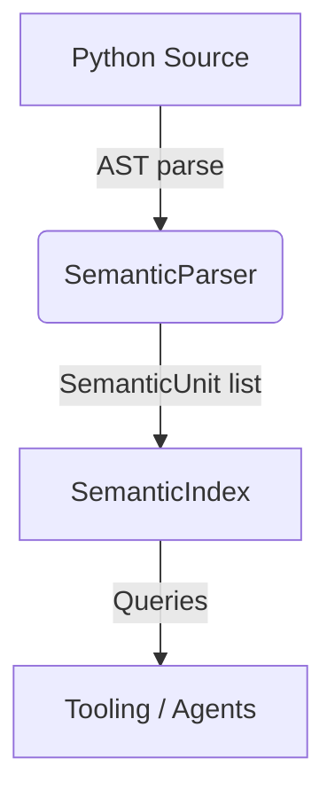
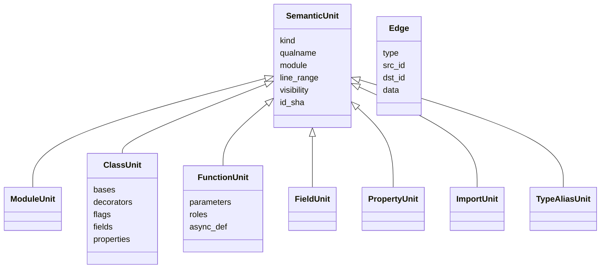

# Semantic Index (`symindex`)

The `src/utils/symindex` package implements the first phase of the semantic
symbol indexing refactor described in
[`docs/python_symbol_tree_semantic_units.md`](./python_symbol_tree_semantic_units.md).
It parses Python source into semantic units and relationships that power
documentation tooling and future semantic queries.

## Conceptual Overview

At a high level symindex builds a graph where each node is a semantic unit
(module, class, function, property, field, import, type alias, …) and edges
capture relationships between them.  The initial implementation focuses on the
`contains` relationship to match the historical symbol view while setting the
stage for future enrichers (overrides, exports, docstring sections, etc.).



Each `SemanticUnit` shares a core set of metadata (`qualname`, `module`,
`line_range`, `visibility`, `id_sha`) to keep identification stable across
refactors.  Specific unit subclasses extend that metadata to expose richer
semantics (e.g. `ClassUnit.bases`, `FunctionUnit.parameters`,
`PropertyUnit.accessor_roles`).

### Unit and Edge Types



Edges are currently limited to `contains` links emitted by the parser, but the
`Edge` datatype has a flexible `data` payload so it can later represent
relationships such as overrides, decorators, or exports without breaking the
API.

## Package Layout

- `model.py`
  - Dataclasses describing semantic units and the `Edge` graph structure.
  - All unit classes inherit from `SemanticUnit`, which stores shared metadata
    and offers a `to_dict()` helper for serialization.

- `parser.py`
  - Pure `ast` traversal that walks a single module, producing units and
    `contains` edges.  It mirrors the historic `PySymbolExtractor` behaviour
    but emits richer structures ready for future pipeline stages.

- `index.py`
  - Defines the `SemanticIndex` container with convenience queries (public API,
    data models) and the `build_semantic_index` factory.

- `__init__.py`
  - Re-exports the key symbols for ergonomic imports such as
    `from src.utils.symindex import build_semantic_index`.

## Pipeline Phases

1. **Parse** – `SemanticParser` visits the AST and emits raw semantic units
   plus `contains` edges.
2. **Index** – `build_semantic_index` wraps the parser output inside a
   `SemanticIndex`, building lookup tables for quick lookups by qualname or
   edge type.
Future phases will insert optional enrichers and resolvers between the parse
and index steps (e.g. docstring parsing, property accessor deduction, override
discovery).  The API surface has been designed so those additions can plug in
without breaking callers.

## Usage

```python
from pathlib import Path

from src.utils.symindex import build_semantic_index

source = Path("example.py").read_text(encoding="utf-8")
index = build_semantic_index(src=source, module="example", filepath="example.py")

public_api = index.list_public_api()
print([unit.qualname for unit in public_api])
```

## Future Work

- Implement resolvers for property accessors, overrides, and exports.
- Add enrichers that decorate units with roles (dataclass, pydantic, enum).
- Extend the edge set beyond `contains` to include relationships such as
  `extends`, `overrides`, and `imports`.
