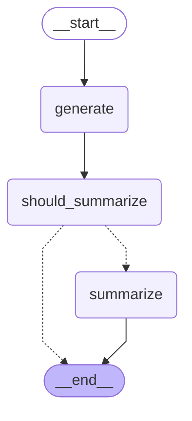

# Chat Agent

A LangGraph-powered conversational agent that provides friendly, time-aware responses and automatic context summarization to keep conversations flowing without exceeding token limits. The agent is provider-agnostic (Ollama/OpenAI via LangChain) and exposes a small, consistent API for sync/async use and server deployment.

## Highlights

- Time-aware system prompt injected on every turn (local timezone aware)
- Sliding window with approximate token accounting and auto‑summarization
- Keeps a short tail of recent messages for context after summaries
- Provider abstraction: Ollama (via `LLM_BASE_URL`) or OpenAI (no base URL)
- Async‑first execution with optional graph streaming
- Simple, typed state shape for easy integration

---

## Architecture

The compiled graph has three nodes with a conditional branch:

1) `generate` — Builds a time‑aware system prompt and calls the chat model
2) `should_summarize` — Checks rolling window token usage
3) `summarize` — Produces/extends a short conversation summary and prunes state

Mermaid diagram (see also ARCHITECTURE.md):



---

## Public API

- Class: `chatagent.agent.ChatAgent` (`src/chatagent/agent.py`)
- Config: `chatagent.agent.ChatAgentConfig` (`src/chatagent/agent.py`)
- State type: `chatagent.config.AgentState` (`src/chatagent/config.py`)
- LangGraph server export: `chatagent` (`src/chatagent/agent.py:255`)

### State shape (TypedDict)

`AgentState` keys you typically use:

- `messages: list[BaseMessage]` — Current turn messages (LangChain format)
- `history: list[BaseMessage]` — Rolling history the agent keeps for you
- `summary: str | None` — Short rolling summary used for context compression
- `stream: bool` — If true, the model call uses streaming under the hood
- `stats: { window_tokens, last_step_tokens }` — Approx token accounting
- `metadata: { run_id, user_id? }` — Optional observability metadata

### Outputs

Every call returns a dict with at least:

- `messages: list[BaseMessage]` — Last assistant message(s) produced
- `history: list[BaseMessage]` — Updated history (user tail + assistant reply)
- `stats: dict` — Updated window and last step token counts
- `summary: str` — Present when summarization triggers on this turn

---

## Usage

### Python API (sync/async)

```python
from chatagent.agent import ChatAgent, ChatAgentConfig
from chatagent.config import AgentState
from langchain_core.messages import HumanMessage

agent = ChatAgent(ChatAgentConfig(
    model_name="llama3.1",
    base_url="http://localhost:11434",  # omit for OpenAI via SDK defaults
    temperature=0.5,
))

state: AgentState = {
    "messages": [HumanMessage(content="Hello! Can you help me?")],
    "history": [],
    "summary": None,
    "stats": {},
    "metadata": {"run_id": "demo-1"},
}

# Sync facade (runs outside event loop)
out = agent.invoke(state)
print(out["messages"][0].content)

# Async
# out = await agent.ainvoke(state)
```

### Streaming

Set `state["stream"] = True` to use the model’s streaming API during the `generate` step. The agent assembles the final text for you; to observe graph events as they occur use the async stream:

```python
state["stream"] = True
async for ev in agent.astream(state):
    print(ev)
```

### Mermaid diagram

```python
diagram = agent.get_mermaid()
print(diagram)
```

### LangGraph server

This module exposes a ready‑to‑use export named `chatagent` (`src/chatagent/agent.py:255`). It’s referenced in `langgraph.json` so you can run:

```bash
langgraph dev
# POST http://localhost:8123/chatagent/invoke
```

---

## Configuration

### ChatAgentConfig

- `messages_to_keep: int = 5` — Messages to keep after each summary
- `max_tokens_before_summary: int = 4000` — Rolling window limit for auto‑summary
- `model_name: str | None` — Provider/model id (e.g., `llama3.1`)
- `base_url: str | None` — Provider base URL; when set, selects Ollama
- `temperature: float = 0.5` — Model sampling temperature
- `num_ctx: int | None` — Context window hint for Ollama
- `tz_name: str | None` — IANA timezone (default from global settings)
- `default_stream: bool = False` — Default preference (pass `stream` in state per call)

Values omitted in the config are filled from global settings (`src/config.py`).

### Environment variables

Used by the default server export and global settings:

- Core model
  - `MODEL_NAME` or `CHAT_MODEL_NAME`
  - `LLM_BASE_URL` (or `BASE_URL`)
  - `TIMEZONE` (or `TZ_NAME`) — IANA zone, e.g. `America/Sao_Paulo`
- Chat behavior
  - `CHAT_MESSAGES_TO_KEEP` — defaults to `5`
  - `CHAT_MAX_TOKENS_BEFORE_SUMMARY` — defaults to `4000`
  - `CHAT_TEMPERATURE` — defaults to `0.5`

Example `.env` snippet:

```env
MODEL_NAME=llama3.1
LLM_BASE_URL=http://localhost:11434
TIMEZONE=America/Sao_Paulo
CHAT_MESSAGES_TO_KEEP=5
CHAT_MAX_TOKENS_BEFORE_SUMMARY=4000
CHAT_TEMPERATURE=0.5
```

---

## Prompts and summarization

- System prompt: `ASSISTANT_SYSTEM_PROMPT` (`src/chatagent/prompts.py`) injects a standardized clock line built by `core.time.build_chat_clock_vars` and the rolling `summary`.
- Summarizer: `OllamaSummarizer` (`src/chatagent/summarizer.py`) builds a concise summary and returns a partial state update: `{ "summary": str, "messages": [REMOVE_ALL_MESSAGES, *tail] }` to prune context while keeping the last `k` messages.
- Token accounting: `utils.messages.TokenEstimator` provides approximate counts to decide when to summarize.

You can swap the summarizer at runtime:

```python
from chatagent.summarizer import OpenAISummarizer
agent = ChatAgent(ChatAgentConfig())
agent.summarizer = OpenAISummarizer(model_id="gpt-5-nano")
```

---

## Notes on history and tokens

- After each turn, `history` is extended with the last user message (if present) and the assistant reply.
- `stats.window_tokens` accumulates input+output estimates and resets to `0` after a summary.
- Summarization keeps only the last `messages_to_keep` items in `messages`; the short `summary` carries the rest of the context.

---

## Testing

Tests mock the model to avoid network calls. From the repo root:

```bash
pytest -k chatagent -q
```

---

## Troubleshooting

- “model_name must be set …”: Provide `ChatAgentConfig.model_name` or set `MODEL_NAME`.
- Timezone fallback: If the provided timezone is invalid, the agent falls back to `UTC` and logs a warning.
- Streaming expectations: `state["stream"] = True` streams the model call internally but the agent returns the final assembled message. Use `agent.astream(...)` to observe graph events.

---

## File map

- `src/chatagent/agent.py` — Agent and config, graph compilation, server export
- `src/chatagent/config.py` — TypedDict for state and Summarizer protocol
- `src/chatagent/prompts.py` — System and summarizer prompts
- `src/chatagent/summarizer.py` — Summarizer implementations (Ollama/OpenAI)
- `src/core/time.py` — Time utilities used by the system prompt
- `src/utils/messages.py` — Token estimator and message helpers

